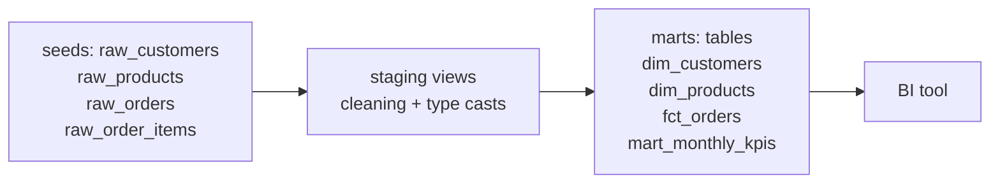

# dbt Retail Analytics

A dbt transformation layer for a synthetic retail business: raw CSV seeds go in,
tested staging views and marts come out. **Verified: `dbt build` passes 43/43
nodes — 4 seeds, 8 models, 31 data tests, 0 warnings.**

## Architecture



| Layer | Models | Materialized as |
|-------|--------|-----------------|
| seeds | 4 raw CSVs (15K orders, 37.5K line items) | tables |
| staging | `stg_customers`, `stg_products`, `stg_orders`, `stg_order_items` | views |
| marts | `dim_customers`, `dim_products`, `fct_orders`, `mart_monthly_kpis` | tables |

**Key business logic** (in `fct_orders`): revenue, cost, and profit are computed
per line item, and only `completed` orders contribute revenue — cancelled and
returned lines are kept with zeroed financials for funnel analysis.

**Testing:** 31 data tests (`unique`, `not_null`, `relationships`,
`accepted_values`) plus a singular test (`assert_no_negative_revenue`).
Mart totals tie out to the companion
[SQL warehouse project](https://github.com/Narasimha3008/sql-analytics-warehouse):
$8.52M revenue, $5.01M profit across 32 months.

## Run it

```bash
pip install dbt-duckdb
export DBT_PROFILES_DIR=.   # uses the committed profiles.yml
dbt build                    # seeds + models + tests
```

Runs on DuckDB — no warehouse credentials needed, same SQL you'd write on
Snowflake. Point `profiles.yml` at Snowflake/Databricks to run it in production.

## Design notes

- Staging is thin (clean + cast only); all business logic lives in marts, so it's easy to find and audit.
- Every model and column that matters has a test or a description — `dbt docs generate` produces browsable documentation.
- CI (`.github/workflows/ci.yml`) runs `dbt build` on every push.

## Skills demonstrated

dbt (models, seeds, tests, docs) · SQL data modeling (star schema, marts) ·
data quality testing · CI for analytics
